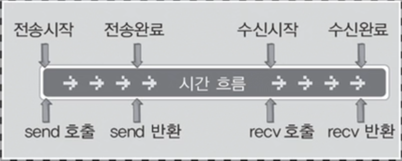

# Async Notification I/O 모델

<br>

## Async Notification I/O 모델의 이해

<br>

### 동기 입출력

<br>

 <br>

- 입출력 함수의 호출 및 반환의 시기가 데이터 전송의 시작 및 완료의 시기와 일치한다
- 함수가 호출된 동안에는 다른 작업을 할 수 없다
- 여기서 전송 완료란 TCP에서 데이터의 전송을 보장하기 때문에 버퍼에 데이터를 모두 write 했을 때를 의미한다
- select 함수는 입출력이 완료 또는 가능한 상태가 되었을 때 반환을 하므로 대표적인 동기 notification 모델이다

<br>

### 비동기 입출력

<br>

 <br>

- 입출력 함수의 호출 시점이 데이터의 송수신이 시작되는 시점이다
- 내부적으로 계속해서 입출력이 진행되는 방식이다
- select 함수의 비동기 버전이 WSAEventSelect 함수이다
- WSAEventSelect 함수는 입출력의 완료에 상관없이 무조건 반환을 한다. 따라서 입출력의 완료를 확인하기 위해 별도의 과정을 거쳐야 한다
- WSAEventSelect 함수를 이용하면 I/O의 상태변화를 명령한 이후 기타 작업을 수행한 다음 I/O의 상태변화를 확인할 수 있다

<br>

### WSAEventSelect 함수와 Notification

<br>

```c
#include<winsock2.h>

int WSAEventSelect(SOCKET s, WSAEVENT hEventObject, long lNetworkEvents);
// s: 관찰대상인 소켓의 핸들 전달
// hEventObject: 이벤트 발생유무의 확인을 위한 Event 오브젝트의 핸들 전달
// lNetworkEvents: 감시하고자 하는 이벤트의 유형 정보 전달
```
> 성공 시 0, 실패 시 SOCKET_ERROR 반환
- FD_READ: 수신할 데이터의 존재 여부
- FD_WRITE: blocking 없이 데이터의 전송 가능 여부
- FD_OOB: out-of-band 데이터의 수신 여부
- FD_ACCEPT: 연결 요청 여부
- FD_CLOSE: 연결 종료 요청 여부
- 전달된 이벤트 중 하나가 발생하면 hEventObject에 전달 된 핸들의 커널 오브젝트를 signaled 상태로 바꾼다
- 소켓 하나당 한 번의 함수 호출이 진행된다
- 한 번 등록된 소켓은 select 함수와 달리 매 함수호출 때마다 재등록을 할 필요가 없다

<br>

### manual-reset 모드 Event 오브젝트의 또 다른 생성방법

<br>

```c
#include<winsock2.h>

WSAEVENT WSACreateEvent(void);        // 이벤트 생성

BOOL WSACloseEvent(WSAEVENT hEvent);  // 이벤트 소멸
// 성공 시 TRUE, 실패 시 FALSE 반환
```
> 성공 시 Event 오브젝트 핸들, 실패 시 WSA_INVALID_EVNET 반환

<br>

### 이벤트 발생유무의 확인에 사용되는 함수

<br>

```c
#include<winsock2.h>

DWORD WSAWaitForMultipleEvents(
	DWORD cEvents, cons WSAEVENT* lphEvents, BOOL fWaitAll, DWORD dwTimeout, BOOL fAlertable);
// cEvents: signaled 상태로의 전이 여부를 확인할 Event 오브젝트의 개수 정보 전달
// lphEvents: Event 오브젝트의 핸들을 저장하고 있는 배열의 주소 값 전달
// fWaitAll: TRUE 전달 시 모든 Event 오브젝트가 signaled 상태일 때 반환
//           FALSE 전달 시 하나만 signaled 상태가 되어도 반환
// dwTimeout: 1/1000초 단위로 타임아웃 지정, WSA_INFINITE 전달 시 signaled 상태가 될 때 까지 반환하지 않는다
// fAlertable: TRUE 전달 시, alertable wait 상태로의 진입
// 반환 값: 반환된 정수 값에서 상수 값 WSA_WAIT_EVENT_0을 빼면 두 번째 매개변수로
//          전달된 배열을 기준으로, signaled 상태가 된 Event 오브젝트의 핸들이 저장된
//          인덱스가 계산된다. 만약에 둘 이상의 Event 오브젝트가 signaled 상태로 변했다면
//          그 중 작은 인덱스 값이 계산된다. 그리고 타임아웃이 발생하면 WAIT_TIMEOUT이 반환된다
```
> 성공 시 이벤트 발생 오브젝트 관련 정보, 실패 시 WSA_INVALID_EVENT 반환
- 기능적으로만 보면 WSAWaitForSingleObject와 차이가 없다
- 위의 함수를 통해 변화가 발생한 소켓이 있는지 원하는 시점에 알 수 있다

<br>

### 이벤트 발생유무 확인 예시

<br>

```c
int posInfo, startIdx, i;

posInfo=WSAWaitForMultipleEvents(numOfsock, hEventArray, FALSE, WSA_INFINITE, FALSE);
atartIdx=posInfo-WSA_WAIT_EVENT_0;

for(i=startIdx; i<numOfsock; i++)
{
	int sigEventIdx=WSAWaitForMultipleEvents(1, &hEventsArray[i], TRUE, 0, FALSE);
}
```
> 이벤트가 발생한 가장 작은 idx가 반환되기 때문에 반복문을 통해 일일이 오브젝트에서 이벤트가 발생했는지 확인할 수 있다
- Event 오브젝트가 manual-reset 모드기 때문에 signaled 상태가 된 Event 오브젝트를 모두 확인할 수 있다

<br>

### 이벤트 종류의 구분을 위한 함수

<br>

```c
#include<winsock2.h>

int WSAEnumNetworkEvents(
	SOCKET s, WSAEVENT hEventObject, LPWSANETWORKEVENTS lpNetworkEvents);
// s: 이벤트가 발생한 소켓의 핸들 전달
// hEventObject: 소켓과 연결된(WSAEventSelect 함수호출에 의해),
//               signaled 상태인 Event 오브젝트의 핸들 전달
// lpNetworkEvents: 발생한 이벤트의 유형정보와 오류정보로 채워질 WSANETWORKEVENTS
//                  구조체 변수의 주소 값 전달

typedef struct _WSANETWORKEVENTS
{
	long lNetworkEvents;
	int iErrorCode[FD_MAX_EVENTS];
}WSANETWORKEVENTS, *LPWSANETWORKEVENTS;
// lNetworkEvents: 수신할 데이터가 존재하면 FD_READ, 연결 요청이 있으면 FD_ACCEPT
// iErrorCode: 이벤트 FD_XXX 관련 오류가 발생하면 iErrorCode[FD_XXX_BIT]에 0 이외의 값이 저장된다
```
> 성공 시 0, 실패 시 SOCKET_ERROR 반환

<br>

### 이벤트 종류의 구분과 오류 검사의 예시

<br>

```c
WSANETWORKEVENTS netEvents;

WSAEnumNetworkEvents(hSock, hEvent, &netEvents);
if(netEvents.lNetworkEvents & FD_ACCEPT)
{
	// FD_ACCEPT 이벤트 발생에 대한 처리
}
if(netEvents.lNetworkEvents & FD_READ)
{
	// FD_READ 이벤트 발생에 대한 처리
}
if(netEvents.lNetworkEvents & FD_CLOSE)
{
	// FD_CLOSE 이벤트 발생에 대한 처리
}
if(netEvents.iErrorCode[FD_READ_BIT]!=0)
{
	// FD_READ 관련 오류 처리
}
```

<br>

## ASync Notification I/O 모델의 구현

<br>

```c
#include<stdio.h>
#include<string.h>
#include<winsock2.h>

#define BUF_SIZE 100

void CompressSockets(SOCKET hSockArr[], int idx, int total);
void CompressEvents(WSAEVENT hEventArr[], int idx, int total);
void ErrorHandling(char *msg);

int main(int argc, char *argv[])
{
	WSADATA wsdData;
	SOCKET hServSock, hClntSock;
	SOCKADDR_IN servAdr, clntAdr;
	
	// 동일한 수의 오브젝트를 저장하기 위한 배열 
	SOCKET hSockArr[WSA_MAXIMUM_WAIT_EVETNS];      // 소켓의 핸들 정보를 저장하기 위한 배열
	WSAEVENT hEventArr[WSA_MAXIMUM_WAIT_EVENTS];   // 이벤트 오브젝트 핸들을 저장하기 위한 배열

	WSAEVENT newEvent;
	WSANETWORKEVENTS netEvents;

	int numOfClntSock=0;
	int strLen, i;
	int posInfo, startidx;
	int clntAdrLen;
	char msg[BUF_SIZE];

	if(argc!=2)
	{
		printf("Usage: %s <port>\n", argv[0]);
		exit(1);
	}
	if(WSAStartup(MAKEWORD(2, 2), &wsaData) != 0)
		ErrorHandling("WSAStartup() error!");
	
	hServSock=socket(PF_INET, SOCK_STREAM, 0);
	servAdr.sin_family=AF_INET;
	servAdr.sin_addr.s_addr=htol(INADDR_ANY);
	servAdr.sin_port=htons(atoi(argv[1]));

	if(bind(hServSock, (SOCKADDR*) &servAdr, sizeof(servAdr))==SOCKET_ERROR)
		ErrorHandling("bind() error!");

	if(listen(hServSock, 5)==SOCKET_ERROR)
		ErrorHandling("listen() error!");

	newEvent=WSACreateEvent();   // event 오브젝트 생성
	// hServSock에 ACCEPT 요청이 들어왔을 때 newEvent를 signaled 상태로 바꾼다
	if(WSAEventSelect(hServSock, newEvent, FD_ACCEPT)==SOCKET_ERROR)
		ErrorHandling("WSAEventSelect() error!");
	
	// 동일한 인덱스에 오브젝트 추가
	hSockArr[numOfClntSock]=hServSock;
	hEventArr[numOfClntSock]=newEvent;
	numOfClntSock++;

	while(1)
	{
		posInfo=WSAWaitForMultipleEvents(
			numOfClntSock, hEventArr, FALSE, WSA_INFINITE, FASLE);
		startidx=posInfo-WSA_WAIT_EVENT_0;

		for(i=startidx; i<numOfClntScok; i++)
		{
			int sigEvent=
				WSAWaitForMultipleEvents(1, &hEventArr[i], TRUE, 0 FALSE);
			if((sigEvent==WSA_WAIT_FAILED || sigEventIdx==WSA_WAIT_TIMEOUT))
				continue
			else
			{
				sigEventIdx=i;
				WSAEnumNetworkEvents(
					hSockArr[sigEventIdx], hEventArr[sigEventIdx], &netEvents);
				if(netEvents.lNetworkEvents & Fd_ACCEPT)
				{
					if(netEvents.iErrorCode[FD_ACCEPT_BIT]!=0)
					{
						puts("Accept Error");
						break;
					}
					clntAdrLen=sizeof(clntAdr);
					hClntSock=accept(
						hSockArr[sigEventIdx], (SOCKADDR*) &clntAdr, &clntAdrLen);
					newEnvet=WSACreateEvent();
					WSAEventSelect(hClntSock, newEvent, FD_READ | FD_CLOSE);
					
					hEventArr[numOfClntSock]=newEvent;
					hSockArr[numOfClntSock]=hClntSock;
					numOfClntSock++;
					puts("connected new client...");
				}
			
				if(newEvents.lNetworkEvents & FD_READ)
				{
					if(netEvents.iErrorCode[FD_READ_BIT]!=0)
					{
						puts("Read Error");
						break;
					}
					strLen=recv(hSockArr[sigEventIdx], msg, sizeof(msg), 0);
					send(hSockArr[sigEventIdx], msg, strLen, 0);
				}

				if(newEvents.lNetworkEvents & FD_CLOSE)
				{
					if(netEvents.iErrorCode[FD_CLOSE_BIT]!=0)
					{
						puts("Read Error");
						break;
					}
					WSACloseEvent(hEventArr[sigEventIdx]);
					closesocket(hSockArr[sigEventIdx]);

					numOfClntSock--;
					// 이벤트 오브젝트 삭제
					CompressSockets(hSockArr, sigEventIdx, numOfClntSock);
					CompressEvents(hEventArr, sigEventIdx, numOfClntSock);
				}
			}	
		}
	}
	WSACleanup();
	return 0;
}

void CompressSockets(SOCKET hSockArr[], int idx, int total)
{
	int i;
	for(i=idx, i<total; i++)
		hSockArr[i]=hSockArr[i+1];
}
void CompressEvents(WSAEVENT hEventArr[], int idx, int total)
{
	int i;
	for(i=idx, i<total; i++)
		hEventArr[i]=hEventArr[i+1];
}
void ErrorHandling(char *msg)
{
	fputs(msg, stderr);
	fputc('\n', stderr);
	exit(1);
}
```
> 참고 [윤성우 열혈 TCP/IP 프로그래밍]