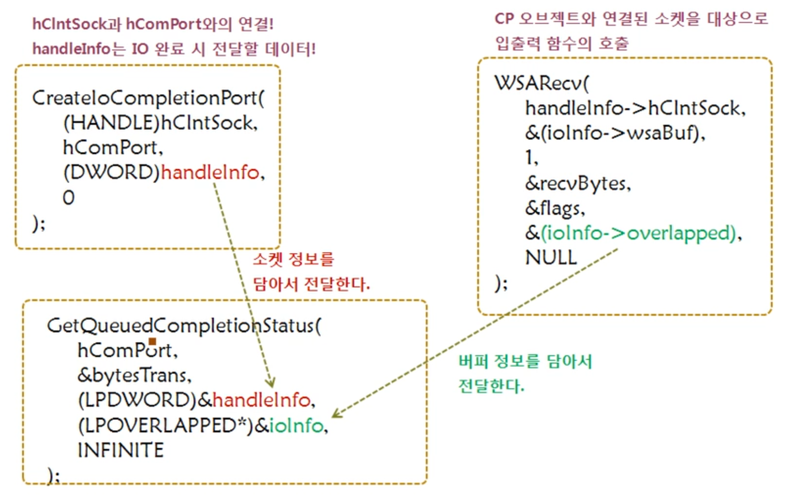

# IOCP(Input Output Completion Port)

<br>

## Overlapped I/O를 기반으로 IOCP 이해하기

<br>

### non-blocking 모드의 소켓 생성

<br>

```c
SOCKET hLisnSock;
int mode=1;

hLisnSock=WSASocket(PF_INET, SOCK_STREAM, 0, NULL, 0, WSA_FLAG_OVERLAPPED);
ioctlsocket(hLisnSock, FIONBIO, &mode);  // for non-blocking socket
// 입출력 모드(FIONBIO)를 변수 mode에 저장된 값으로 바꿔라
```

<br>

### non-blocking 모드 소켓의 입출력 이외의 추가적인 특징
- 클라이언트의 연결요청이 존재하지 않는 상태에서 accept 함수가 호출되면 INVALID_SOCKET이 곧바로 반환된다
- 이어서 WSAGetLastError 함수를 호출하면 WSAEWOULDBLOCK가 반환된다
- accept 함수 호출을 통해서 새로 생성되는 소켓 역시 non-blocking 속성을 지닌다

<br>

### Overlapped I/O만 가지고 에코 서버 구현하기

<br>

```c
while(1)
{
	SleepEx(100, TRUE);   // for alertable wait state
	hRecvSock=accept(hLisnSock, (SOCKADDR*)&recvAdr, &recvAdrSz);
	if(hRecvSock==INVALID_SOCKET)
	{
		if(WSAGetLastError()==WSAEWOULDBOLCK)
			continue;
		else
			ErrorHandling("accept() error");
	}
	puts("Client connected...");
	lpOvLp=(LPWSAOVERLAPPED)malloc(sizeof(WSAOVERLAPPED));
	memset(lpOvLp, 0, sizeof(WSAOVERLAPPED));
	
	hbInfo=(LPPER_IO_DATA)malloc(sizeof(PER_IO_DATA));
	hbInfo->hClntSock=(DWORD)hRecvSock;
	(hbInfo->wsaBuf).buf=hbInfo->buf;
	(hbInfo->wsaBuf).len=BUF_SIZE;
	
	lpOvLp->hEvent=(HANDLE)hbInfo;
	WSARecv(hRecvSock, &(hbInfo->wsaBuf), 1, &recvBytes, &flagInfo, lpOvLp, ReadCompRoutine);
}

typedef struct
{
	SOCKET hClntSock;
	char buf[BUF_SIZE];
	WSABUF wsaBuf;
}PER_IO_DATA, *LPPER_IO_DATA;
```
> 서버의 클라이언트 연결 루틴, 데이터 수신 시 ReadCompRoutine 함수가 호출된다

<br>

### ReadCompRoutine, WriteCompRoutine

<br>

```c
void CALLBACK ReadCompRoutine(
	DWORD dwError, DWORD szRecvBytes, LPWSAOVERLAPPED lpOverlapped, DWORD flags)
{
	LPPER_IO_DATA hbInfo=(LPPER_IO_DATA)(lpOverlapped->hEvent);
	SOCKET hSock=hbInfo->hClntSock;
	LPWSABUF bufInfo=&(hbInfo->wsaBuf);
	DWORD sentBytes;
	// 수신된 데이터가 0이라면 연결 종료 요청
	if(szRecvBytes==0)
	{
		closesocket(hSock);
		free(lpOverlapped->hEvent); free(lpOverlapped);
		puts("Client disconnectd...");
	}
	else  // echo!
	{
		// 에코 서비스 제공 동시에 전송 완료 시 WriteCompRoutine 호출
		bufInfo->len=szRecvBytes;
		WSASend(hSock, bufinfo, 1, &sentBytes, 0, lpOverlapped, WriteCompRoutine);
	}
}

void CALLBACK WriteCompRoutine(
	DWORD dwError, DWORD szSendBytes, LPWSAOVERLAPPED lpOverlapped, DWORD flags)
{
	LPPER_IO_DATA hbInfo=(LPPER_IO_DATA)(lpOverlapped->hEvent);
	SOCKET hSock=hbInfo->hClntSock;
	LPWSABUF bufInfo=&(hbInfo->wsaBuf);
	DWORD recvBytes;
	int flagInfo=0;
	// 데이터 전송이 완료되고 나면 계속 된 서비스를 위해 WSARecv 함수가 호출되도록 한다
	WSARecv(hSock, bufInfo, 1, &recvBytes, &flagInfo, lpOverlapped, ReadCompRoutine);
}
```
> ReadCompRoutine 함수와 WriteCompRoutine 함수가 반복 호출되면서 에코 서비스를 제공한다

<br>

### 클라이언트의 재구현

<br>

```c
while(1)
{
	fputs("Input message(Q to Quit): ", stdout);
	fgets(message, BUF_SIZE, stdin);
	if(!strcmp(message, "q\n") || !strcmp(message, "Q\n"))
		break;
	strLen=strlen(message);
	send(hSocket, message, strLen, 0);
	readLen=0;
	while(1)
	{
		// TCP의 정상적인 구현을 위해 전송한 데이터를 전부 수신하는 형태
		readLen+=recv(hSocket, &message[readLen], BUF_SIZE-1, 0);
		if(readLen>=strLen)
			break;
	}
	message[strLen]=0;
	printf("Message from server: %s", message);
}
```
> 서버가 non-blocking 모드로 동작하기 때문에 제대로 된 TCP 클라이언트를 작성해야한다

<br>

### Overlapped I/O 모델의 문제점
- non-blocking 모드의 accept 함수와 alertable wait 상태로의 진입을 위한 SleepEx 함수가 번갈아가면서 반복 호출되는 것은 성능에 영향을 미칠 수 있다

<br>

### Overlapped I/O 모델이 지니는 문제점의 해결책
- accept 함수의 호출은 main 스레드가 처리하도록 하고 별도의 스레드를 추가로 하나 생성해서 클라이언트와의 입출력을 담당하게 한다
- 이를 토대로 구성된 서버 모델이 바로 IOCP 이다

<br>

## IOCP의 단계적 구현

<br>

### IOCP의 구현
1. 소켓의 연결 요청 수락
2. IOCP 오브젝트 생성 -> 소켓 등록 가능
    - 입출력이 완료되면 IOCP 오브젝트에 정보가 등록되고 확인할 수 있다
3. 스레드를 할당하여 I/O 완료 이후의 루틴을 처리한다

<br>

### IOCP의 기본 모델
- IOCP에서는 완료된 I/O의 정보가 `Completion Port 오브젝트`(CP 오브젝트)라는 커널 오브젝트에 등록된다
- 이 소켓을 기반으로 진행되는 I/O 완료 상황은 CP 오브젝트에 등록해야 한다

<br>

### IOCP의 기본 조건
- CP 오브젝트에 I/O의 완료가 등록될 수 있도록 다음 두 가지가 선행되어야 한다
    1. Completion Port 오브젝트의 생서
    2. Completion Port 오브젝트와 I/O의 완료를 등록할 소켓과의 연결
- 위의 두 가지 작업을 위해서 정의된 함수가 `CreateIoCompletionPort`
- CreateIoCompletionPort 함수는 CP 오브젝트의 생성과 생성된 CP 오브젝트와 소켓과의 연결을 목적으로 사용한다

<br>

### CreateCompletionPort 함수의 두 가지 기능

<br>

```c
#include<windows.h>

HANDLE CreateIoCompletionPort(
	HANDLE FileHandle, HANDLE ExistingCompletionPort, ULONG_PRT CompletionKye,
	DWORD NumberOffConcurrentThreads);
// FileHandle: CP 오브젝트 생성시에는 INVALID_HANDLE_VALUE를 전달
// ExistingCompletionPort: CP 오브젝트 생성시에는 NULL 전달
// CompletionKye: CP 오브젝트 생성시에는 0 전달
// NumberOffConcurrentThreads: CP 오브젝트에 할당되어 완료된 I/O를 처리할 스레드의 수를 전달
//                             0 전달 시 시스템의 CPU 개수가 동시 실행 가능한 스레드의 최대 수로 지정된다

// CP 오브젝트에 할당되어 I/O의 처리를 담당할 스레드의 수를 최대 2개로 제한
HANDLE hCpObject;
hCpObject=CreateIoCompletionPort(INVALID_HANDLE_VALUE, NULL, 0, 2);

// 다음의 CreateIoCompletionPort 함수가 호출된 이후부터는 hSock을 대상으로 진행된 I/O 완료시,
// 해당 정보가 hCpObject에 해당하는 CP 오브젝트에 등록된다
HANDLE hCpObject;
SOCKET hSock;
CreateIoCompletionPort((HANDLE)hSock, hCpObject, (DWORD)ioInfo, 0);
```
> 성공 시 CP 오브젝트의 핸들, 실패 시 NULL 반환

<br>

### Completion Port의 완료된 I/O를 확인하는 GetQueuedCompletionStatus

<br>

```c
#include<windows.h>

BOOL GetQueuedCompletionStatus(
	HANDLE CompletionPort, LPDWORD lpNumberOfBytes, PULONG_PTR lpCompletionKey,
	LPOVERSAPPED* lpOverlapped, DWORD dwMilliseconds);
// CompletionPort: 완료된 I/O 정보가 들어있는 CP 오브젝트의 핸들 전달
// lpNumberOfBytes: 입출력 과정에서 송수신 된 데이터의 크기정보를 저장할 변수의 주소 값 전달
// lpCompletionKey: CreateCompletionPort 함수의 세 번쨰 인자로 전달된 값의 저장을 위한 변수의 주소 값 전달
// lpOverlapped: WSASend, WSARecv 함수 호출 시 전달하는 OVERLAPPED 구조체 변수의 주소 값이 저장 될, 변수의 주소 값 전달
// dwMilliseconds 타임아웃 정보 전달, 여기서 지정한 시간이 완료되면 FALSE를 반환하면서 함수를 빠져나가며,
//                INFINITE를 전달하면 완료된 I/O가 CP 오브젝트에 등록될 떄까지 블로킹 상태에 있는다
```
> 성공 시 TRUE, 실패 시 FALSE 반환
- CreateIoCompletionPort 함수 호출 시 전달된 정보와 WSASend, WSARecv 함수 호출 시 전달된 정보를 얻게된다
- 이 정보를 통해서 클라이언트에게 서비스를 제공하게 된다
- 함수의 반환결과를 통해서 다음 두 가지 정보를 얻어야 한다
    1. 입출력이 발생한 소켓의 핸들 정보
    2. 입출력과 관련된 데이터 송수신 버퍼의 정보

<br>

### GetQueuedCompletionStatus 함수 호출과 데이터의 전달 관계

<br>



<br>

### IOCP 기반의 에코 서버

<br>

```c
typedef struct
{
	SOCKET hClntSock;
	SOCKADDR_IN clntAdr;
}PER_HANDEL_DATA, *LPPER_HANDLE_DATA;

typedef struct
{
	OVERLAPPED overlapped;
	WSABUF wsaBuf;
	char buffer[BUF_SIZE];
	int rwMode
}PER_IO_DATA, *LPPER_IO_DATA;

hComPort=CreateIoCompletionPort(INVALID_HANDLE_VALUE, NULL, 0, 0);
GetSystemInfo(&sysInfo);  // CPU 코어 개수를 얻는다
for(i=0; i<sysInfo.dwNumberOfProcessors; i++)
	_beginthreadex(NULL, 0, EchoThreadMain, (LPVOID)hComPort, 0, NULL0);

hServSock=WSASocket(AF_INET, SOCK_STREAM, 0, NULL, 0, WSA_FALG_OVERLAPPED);
servAdr.sin_family=AF_INET;
servAdr.sin_addr.s_addr=htonl(INADDR_ANY);
servAdr.sin_port=htons(atoi(argv[1]));

bind(hServSock, (SOCKADDR*)&servAdr, sizeof(servAdr));
listen(hServSock, 5);

while(1)
{
	SOCKET hClntSock;
	SOCKADDR_IN clntAdr;
	int addrLen=sizeof(clntAdr);
	
	hClntSock=accept(hServSock, (SOCKADDR*)&clntAdr, &addrLen);
	handleInfo=(LPPER_HANDLE_DATA)malloc(sizeof(PER_HANDLE_DATA));
	handleInfo->hClntSock=hClntSock;
	memcpy(&(handleInfo->clntAdr), &clntAdr, addrLen);
	
	CreateIoComPletionPort((HANDLE)hClntSock, hComPort, (DWORD)handleInfo, 0);
	
	ioInfo=(LPPER_IO_DATA)malloc(sizeof(PER_IO_DATA));
	memset(&(ioInfo->overlapped), 0, sizeof(OVERLAPPED));
	ioInfo->wsaBuf.len=BUF_SIZE;
	ioInfo->wsaBuf.buf=ioInfo->buffer;
	ioInfo->rwMode=READ;
	WSARecv(handleInfo->hClntSock, &(ioInfo->wsaBuf),
		1, &recvBytes, &flags, &(ioInfo->overlapped), NULL);
}

DWORD WINAPI EchoThreadMain(LPVOID pComPort)
{
	HANDLE hComPort=(HANDLE)pComPort;
	SOCKET sock;
	DWORD bytesTrans;
	LPPER_HANDLE_DATA handleInfo;
	LPPER_IO_DATA ioInfo;
	DWORD flags=0;
	
	while(1)
	{
		GetQueuedCompletionStatus(hComPort, &bytesTrans,
			(LPDWORD)&handleInfo, (LPOVERLAPPED*)&ioInfo, INFINITE);
		sock=handleInfo->hClntSock;
		
		if(ioInfo->rwMode==READ)
		{
			puts("message received!");
			if(bytesTrans==0) // EOF 전송 시
			{
				closesocket(sock);
				free(handleInfo); free(ioInfo);
				continue;
			}
			memset(&(ioInfo->overlapped), 0, sizeof(OVERLAPPED));
			ioInfo->wsaBuf.len=bytesTrans;
			ioInfo->rwMode=WRITE;
			WSASend(sock, &(ioInfo->wsaBuf), 1, NULL, 0, &(ioInfo->overlapped), NULL);
		
			ioInfo=(LPPER_IO_DATA)malloc(sizeof(PER_IO_DATA));
			memset(&(ioInfo->overlapped), 0, sizeof(OVERLAPPED));
			ioInfo->wsaBuf.len=BUF_SIZE;
			ioInfo->wsaBuf.buf=ioInfo->buffer;
			ioInfo->rwMode=READ;
			WSARecv(sock, &(ioInfo->wsaBuf), 1, NULL, &flags, &(ioInfo->overlapped), NULL);
		}
		else
		{
			puts("message sent!");
			free(ioInfo);
		}
	}
}
```