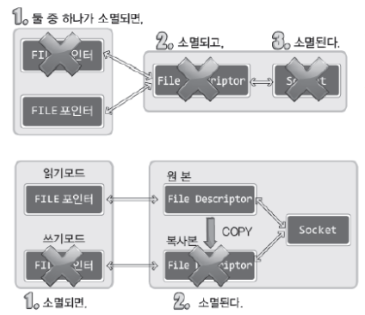

# 입출력 스트림의 분리

<br>


### 목적:
1. 입력루틴과 출력루틴의 독립을 통한 구현의 편의성 증대
2. 입력에 상관없이 출력이 가능하게 함으로 인한 속도의 향상
    * e.g.) 양방향 통신

<br>

### 장점:
1. 파일 포인터는 읽기모드와 쓰기모드를 구분해야한다
2. 읽기, 쓰기의 구분을 통한 구현의 편의성 증대
3. 입력 버퍼와 출력 버퍼를 구분함으로 인한 버퍼링 기능의 향상

<br>

## 스트림 분리 이후의 EOF에 대한 문제점

<br>


### ***fclose() 함수는 half-close가 아닌 소켓의 완전 종료로 이어진다***
> 하나의 소켓을 대상으로 입력, 출력용 FILE 구조체 포인터를 각각 얻었다고 하더라도 둘 중 하나를 대상으로   
> fclose() 함수를 호출하게 되면 소켓의 완전종료로 이어진다.   
> 따라서, fclose()함수 이후 입출력을 진행하지 못한다.

<br>

### 스트림 종료 시 half-close가 진행되지 않는 이유

<br>



<br>

 * 위 모델에서는 하나의 파일 디스크럽터가 두 개의 파일 포인터와 연관이 있기 때문에 파일 디스크립터의 종료와 소켓의 종료로 이어진다
 * 아래 모델에서는 파일 디스크립터의 복사 방법과 소켓의 출력 버퍼를 EOF 전달을 통해서 half-close가 가능하게 끔 구현해야 한다.

<br>

### ***모든 파일 디스크립터가 소멸되어야 소켓도 소멸된다는 것을 명시***

---
<br>

## 파일 디스크립터의 복사

<br>

### dup()을 이용한 복사

<br>

``` c
#include<unistd.h>
int dup(int fildes);
int dup2(int fildes, int fildes2);
```
 * fildes: 복사 할 파일 디스크립터 전달
 * fildes2: 명시적으로 지정할 파일 디스크럽터의 정수 값 전달

<br>

### 복사 후 스트림의 분리

<br>

``` c
readfp=fdopen(clnt_sock, "r");
writefp=fdopen(dup(clnt_sock), "w");

shutdown(flieno(writefp), SHUT_WR);     // half-close 진행, EOF 전달
```