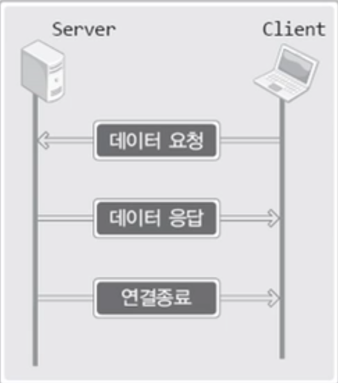
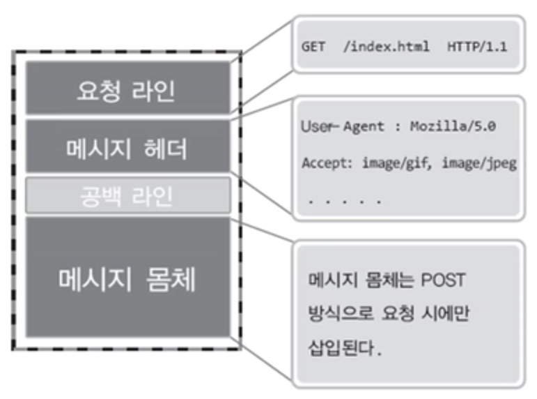
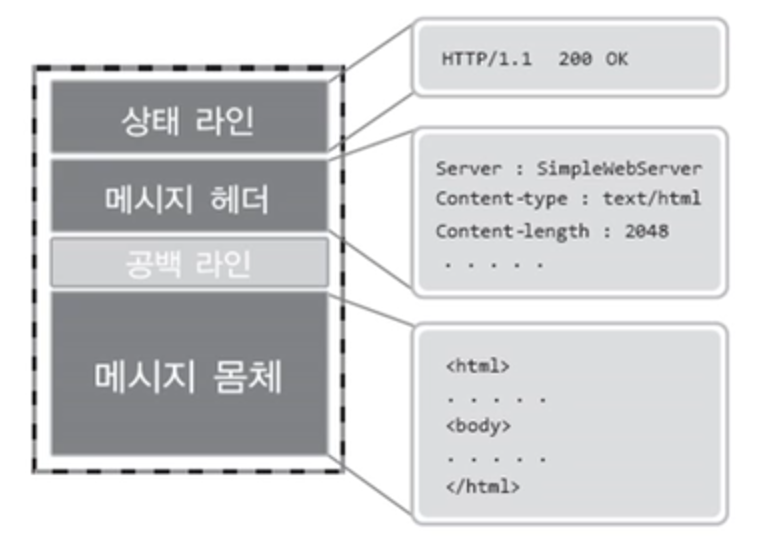

# HTTP(HyperText Transfer Protocol)의 개요

 

### 웹 서버의 기능
1. HTTP 프로토콜을 기반으로 웹 페이지에 해당하는 파일을 클라이언트에게 전송하는 역할의 서버
2. HTTP 프로토콜은 HyperText의 전송을 목적으로 설계된 어플리케이션 레벨의 프로토콜이다
3. HyperText란 마우스의 클릭을 통해서 이동이 가능한 일반적으로 HTML로 이루어진 텍스트를 말한다

 

### HTPP의 기본적인 통신 방식 

 

  

- 상태가 존재하지 않는 stateless 프로토콜이다

 

### HTTP의 요청 방식

 

  

### HTTP의 응답 방식

 

  

### 요청에 대한 상태 코드
 - 200: OK, 요청이 성공적으로 처리됨
 - 404: Not Found, 요청한 파일이 존재하지 안흥ㄴ
 - 400: Bad Request, 요청방식이 잘못되었음
 - 이외에도 다양한 상태 코드가 존재한다