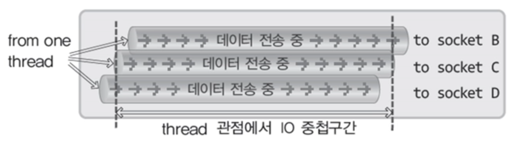

# Overlapped I/O 모델

<br>

## Overlapped I/O 모델의 이해

<br>

### I/O의 중첩이란 ?

<br>



- 스레드의 관점에서 동시에 둘 이상의 데이터 전송을 중첩시키는 것을 뜻한다
- 데이터 전송을 중첩시키기 위해서는 non-blocking 모드로 동작해야 한다
- 데이터 전송의 대상이 소켓 B, C, D로 구분이 되지만, I/O의 중첩은 하나의 소켓을 대상으로 진행이 될 수도 있다
- I/O 중첩은 성능의 저하를 발생시키지 않는다. 데이터 전송은 대역폭에 영향을 받는다
- 전송하고자 하는 데이터의 양이 클수록 I/O 중첩의 효과가 올라간다

<br>

### 비동기 I/O
- I/O 비동기란 non-blocking 모드의 I/O를 뜻한다
- I/O가 비동기 방식으로 동작해야 I/O를 중첩시킬 수 있다
- 윈도우의 Overlapped I/O는 I/O를 중첩시키는 입출력 모델이다

<br>

### Overlapped I/O
- Overlapped I/O 모델이 아니더라도 I/O를 중첩시킬 수 있다
- Overlapped I/O의 포커스는 I/O가 아닌 `입출력의 완료 확인 방법`에 있다
- 비동기 I/O를 진행할 경우 I/O를 중첩시킬 수 있지만 I/O가 완료되었는지 확인해야 한다
- windows의 Overlapped I/O를 이용할 경우 I/O 완료를 체계적으로 확인할 수 있다

<br>

### Overlapped I/O의 소켓 생성

<br>

```c
#include<winsock2.h>

SOCKET WSASocket(
	int af, int type, int protocol, LPWSAPROTOCOL_INFO lpProtocolInfo, GROUP g, DWORD dwFlags);
// af: 프로토콜 체계 정보 전달
// type: 소켓의 데이터 전송방식에 대한 정보 전달
// protocol: 두 소켓 사이에 사용되는 프로토콜 정보 전달
// lpProtocolInfo: 생성되는 소켓의 특성 정보를 담고 있는 WSAPROTOCOL_INFO 구조체 변수의 주소 값 전달
//                 필요 없는 경우 NULL 전달
// g: 함수의 확장을 위해서 예약되어 있는 매개변수, 따라서 0 전달
// dwFlags: 소켓의 속성정보 전달

SOCKET s = WSASocket(PF_INET, SOCK_STREAM, 0, NULL, 0, WSA_FLAG_OVERLAPPED);
// 함수의 마지막 인자로 WSA_FLAG_OVERLAPPED가 전달되어야 한다
```
> 성공 시 소켓의 핸들, 실패 시 INVALID_SOCKET 반환

<br>

### 데이터를 전송하는 WSASend

<br>

```c
#include<winsock2.h>

int WSASend(
	SOCKET s, LPWSABUT lpBuffers, DWORD dwBufferCount,
	LPDWORD lpNumberOfBytesSent, DWORD dwFlags, LPWSAOVERLAPPED lpOverlapped,
	LPWSAOVERLAPPED_COMPLETION_ROUTINE lpCompletionRoutine);
// s: 소켓의 핸들 전달, Overlapped I/O 속성이 부여된 소켓의 핸들 전달 시 Overlapped I/O 모델로 출력 진행
// lpBuffers: 전송할 데이터 정보를 지니는 WSABUF 구조체 변수들로 이루어진 배열의 주소 값 전달
// dwBufferCount: 두 번째 인자로 전달된 배열의 길이 정보 전달
// lpNumberOfBytesSent: 전송된 바이트 수가 저장될 변수의 주소 값 전달
// dwFlags: 함수의 데이터 전송 특성을 변경하는 경우에 사용 e.g.) MSG_OOB
// lpOverlapped: WSAOVERLAPPED 구조체 변수의 주소 값 전달, Event 오브젝트를 사용해서 
//               데이터 전송의 완료를 확인하는 경우에 사용되는 매개변수
// lpCompletionRoutine: Completion Routine이라는 함수의 주소 값 전달, 데이터 전송의 완료 확인 가능
```
> 성공 시 0, 실패 시 SOCKET_ERROR 반환

<br>

### 데이터를 수신하는 WSARecv

<br>

```c
#include<winsock2.h>

int WSARecv(
	SOCKET s, LPWSABUT lpBuffers, DWORD dwBufferCount,
	LPDWORD lpNumberOfBytesRecvd, DWORD lpFlags, LPWSAOVERLAPPED lpOverlapped,
	LPWSAOVERLAPPED_COMPLETION_ROUTINE lpCompletionRoutine);
// s: 소켓의 핸들 전달, Overlapped I/O 속성이 부여된 소켓의 핸들 전달 시 Overlapped I/O 모델로 출력 진행
// lpBuffers: 전송할 데이터 정보를 지니는 WSABUF 구조체 변수들로 이루어진 배열의 주소 값 전달
// dwBufferCount: 두 번째 인자로 전달된 배열의 길이 정보 전달
// lpNumberOfBytesSent: 수신된 바이트 수가 저장될 변수의 주소 값 전달
// lpFlags: 전송특성과 관련된 정보를 지정하거나 수신하는 경우에 사용된다
// lpOverlapped: WSAOVERLAPPED 구조체 변수의 주소 값 전달, Event 오브젝트를 사용해서 
//               데이터 전송의 완료를 확인하는 경우에 사용되는 매개변수
// lpCompletionRoutine: Completion Routine이라는 함수의 주소 값 전달, 데이터 전송의 완료 확인 가능
```
> 성공 시 0, 실패 시 SOCKET_ERROR 반환

<br>

### WSASend의 진행 과정

<br>

```c
typedef struct __WSABUT
{
	u_long len;     // 전송할 데이터의 크기
	char FAR* buf;  // 버퍼의 주소 값
}WSABUT, *LPWSABUF;

typedef struct _WSAOVERLAPPED
{
	// 운영체제 내부적으로 사용되는 멤버
	DWORD Internal;
	DWORD InternalHigh;
	DWORD Offset;
	DWORD OffsetHigh;
	//
	WSAEVENT hEvent;
}WSAOVERLAPPED, *LPWSAOVERLAPPED;

WSAEVENT event;
WSAOVERLAPPED overlapped;
WSABUF databuf;
char buf[BUF_SIZE]={"전송할 데이터"};
int recvBytes=0;

event=WSACreateEvent();
memset(&overlapped, 0, sizeof(overlapped));  // 모든 비트를 0으로 초기화
overlapped.hEvent=event;
dataBuf.len=sizeof(buf);
dataBuf.buf=buf;
WSASent(hSocket, &dataBuf, 1, &recvBytes, 0, &overlapped, NULL);
```
> 함수의 호출과 동시에 데이터의 전송이 완료되지 못하면 의미를 갖지 않는다
- 데이터의 전송이 완료되면 Overlapped가 가르키는 오브젝트가 signaled 상태로 변한다

<br>

### 데이터 송수신 결과를 확인하는 WSAGetOverlappedResult

<br>

```c
#include<winsock2.h>

BOOL WSAGetOverlappedResult(
	SOCKET s, LPWSAOVERLAPPED lpOverlapped, LPDWORD lpcbTransfer, BOOL fWait, LPDWORD lpdwFlags);
// s: Overlapped I/O가 진행된 소켓의 핸들
// lpOverlapped: Overlapped I/O 진행 시 전달한 WSAOVERLAPPED 구조체 변수의 주소 값
// lpcbTransfer: 실제 송수신된 바이트 크기를 저장할 변수의 주소 값
// fWait: 여전히 I/O가 진행중인 상황의 경우 TRUE 전달 시 I/O가 완료될 때 까지 대기하고,
//        FALSE 전달 시 FALSE를 반환하면서 함수를 빠져 나온다
// lpdwFlags: WSARecv함수가 호출된 경우, 부수적인 정보(수신된 메시지가 OOB 인지)를 얻기 위해 사용
```
> 성공 시 TRUE, 실패 시 FALSE 반환
- 데이터 전송이 계속 진행되는 상황에서는 WSASend 함수가 SOCKET_ERROR를 반환한다
- WSAGetLastError 함수 호출을 통해서 확인 가능한 오류 코드로는 WSA_IO_PENDING이 등록된다
- 이 경우에는 위의 함수 호출을 통해서 실제 전송된 데이터의 크기를 확인해야 한다

<br>

## Overlapped I/O 모델에서의 입출력 완료의 확인

<br>

### Event 오브젝트 기반 I/O 확인의 중요한 두 가지
1. I/O가 완료되면 WSAOVERLAPPED 구조체 변수가 참조하는 Event 오브젝트가 signaled 상태가 된다
2. I/O의 완료 및 결과를 확인하려면 WSAGetOverlappedResult 함수를 호출한다

<br>

### Event 오브젝트 기반의 Send

<br>

```c
evObj=WSACreateEvent();   // manual reset mode
memset(&overlapped, 0, sizeof(overlapped));
overlapped.hEvent=evObj;
dataBuf.len=strlen(msg)+1;
dataBuf.buf=msg;

if(WSASend(hSocket, &dataBuf, 1, &sendBytes, 0, &overlapped, NULL)==SOCKET_ERROR)
{
	if(WSAGetLastError()==WSA_IO_PENDING)
	{
		puts("Background data send");
		WSAWaitForMultipleEvents(1, &evObj, TRUE, WSA_INFINITE, FALSE);
		WSAGetOverLappedResult(hSocket, &overlapped, &sendBytes, FALSE, NULL);
	}
	else
	{
		ErrorHandling("WSASend() Error");
	}
}

int WSAGetLastError(void);
// 오류 상황에 대한 상태 값(오류의 원인을 알리는 값) 반환
```
> signaled 상태를 확인한 다음에 실제 전송된 바이트 크기를 확인하는 코드
- WSAWaitForMultipleEvent로 I/O를 확인하더라도 Events 오브젝트가 non-signaled 상태로 변하지 않는다

<br>

### Event 오브젝트 기반의 Recv

<br>

```c
evObj=WSACreateEvent();   // manual reset mode
memset(&overlapped, 0, sizeof(overlapped));
overlapped.hEvent=evObj;
dataBuf.len=BUF_SIZE;
dataBuf.buf=msg;

if(WSARecv(hRecvSock, &dataBuf, 1, &recvBytes, &flags, &overlapped, NULL)==SOCKET_ERROR)
{
	if(WSAGetLastError()==WSA_IO_PENDING)
	{
		puts("Background data receive");
		WSAWaitForMultipleEvents(1, &evObj, TRUE, WSA_INFINITE, FALSE);
		WSAGetOverLappedResult(hRecvSock, &overlapped, &recvBytes, FALSE, NULL);
	}
	else
	{
		ErrorHandling("WSARecv() Error");
	}
}
```

<br>

### Completion Routine의 이해와 등록
- I/O 완료되었을 때 호출되는 함수를 가리켜 Completion Routine이라 한다
- I/O가 완료되면 미리 등록된 Completion Routine이 운영체제에 의해서 자동으로 호출된다
- Completion Routine이 호출되기 위해서는 해당 스레드가 `alterable wait`상태에 놓여야한다
- `alterable wait` 상태는 운영체제가 전달하는 메시지의 수신이 가능한 상태 즉, 특별한 일을 진행하지 않는 상태를 뜻한다

<br>

### Alterable wait 상태로의 진입에 사용되는 함수들
- WaitForSingleObject
- WaitForMultipleObject
- WSAWaitForMultipleEvents
- SleepEx

<br>

### Completion Routine 예시

<br>

```c
hRecvSock=accept(hLisnSock, (SOCKADDR*)&recvAdr, &recvAdrSz);
if(hRecvSock==INVALID_SOCKET)
	ErrorHandling("accept() error");

memset(&overlapped, 0, sizeof(overlapped));
dataBuf.len=BUF_SIZE;
dataBuf.buf=buf;
evObj=WSACreateEvent();   // dummy event object

if(WSARecv(hRecvSock, &databuf, 1, &recvBytes, &flags, &overlapped, CompRoutine)==SOCKET_ERROR)
{
	if(WSAGetLastError()==WSA_IO_PENDING)
		puts("Background data receive");
}

idx=WSAWaitForMultipleEvents(1, &evObj, FALSE, WSAINFINITE, TRUE); // alertable wait 상태로 진입
if(idx==WAIT_IO_COMPLETION)
	puts("Overlapped I/O Completed");
else
	ErrorHandling("WSARecv() error");

void CALLBACK CompRoutine(
	DWORD dwError, DWORD szRecvBytes, LPWSAOVERLAPPED lpOverlapped, DWORD flags)
{
	if(dwError!=0)
		ErrorHandling("CompRoutine error");
	else
	{
		recvBytes=szRecvBytes;
		printf("Received messags: %s \n", buf);
	}
}
```