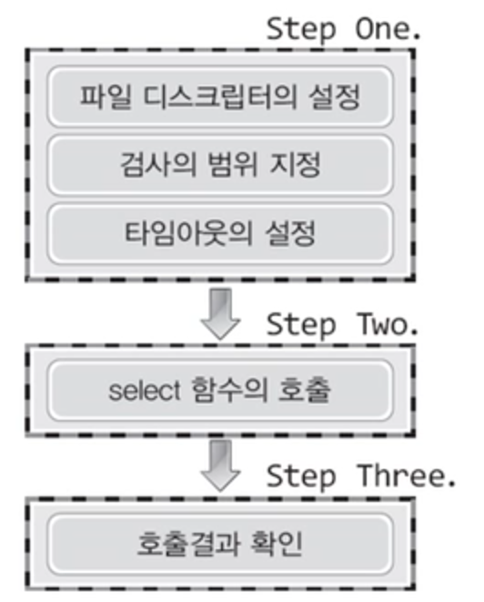
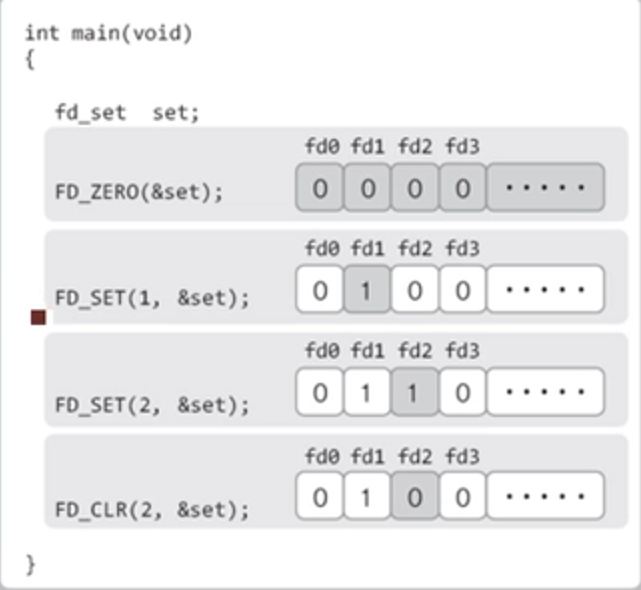
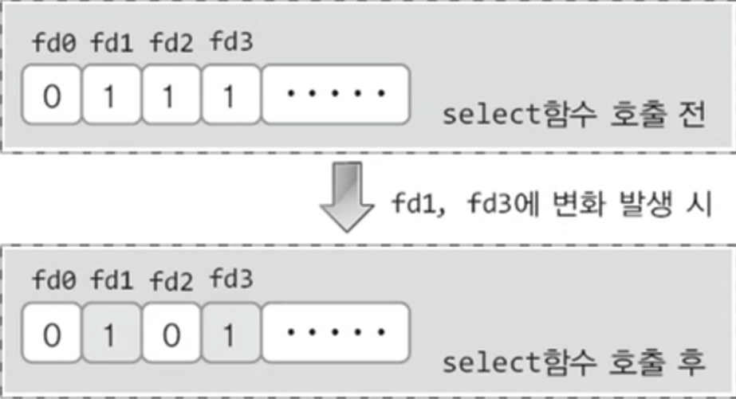

# Select & Epoll

<br>

## Select
> select 함수를 이용하면 배열에 저장된 다수의 파일 디스크립터를 대상으로 다음과 같은 질문을 던질 수 있다

 - 수신한 데이터를 지니고 있는 소켓이 존재하는가? -> `read`
 - 블로킹되지 않고 데이터의 전송이 가능한 소켓은 무엇인가? -> `write`
 - 예외상황이 발생한 소켓은 무엇인가?

<br>



1. 관찰의 대상을 묶고 관찰의 유형을 지정한다
2. 관찰 대상의 변화를 묻는다
3. 물음에 대한 답을 듣는다

<br>

### 파일 디스크립터의 설정

<br>



<br>

```c
// 인자로 전달된 주소의 fd_set형 변수의 모든 비트를 0으로 초기화
FD_ZERO(fd_set *fdset)

// 매개변수 fdset으로 전달된 주소의 변수에 매개변수 fd로 전달된 파일 디스크립터 정보를 등록한다
FD_SET(int fd, fd_set *fdset)

// 매개변수 fdset으로 전달된 주소의 변수에서 매개변수 fd로 전달된 파일 디스크립터 정보를 삭제한다
FD_CLR(int fd, fd_set *fdset)

// 매개변수 fdset으로 전달된 주소의 변수에 매개변수 fd로 전달된 파일 디스크립터 정보가 있으면 양수를 반환한다
FD_ISSET(int fd, fd_set *fdset)
```

<br>

### select 함수의 사용

<br>

```c
#include<sys/select.h>
#include<sys/time.h>

int select(
        int maxfd, fd_set *readset, fd_set *writeset, fd_set *exceptset, const struct timeval *timeout);
// maxfd: 검사 대상이 되는 파일 디스크립터의 수
// readset: fd_set형 변수에 `수신된 데이터의 존재여부`에 관심 있는 파일 디스크립터 정보를 모두 등록해서
//          그 변수의 주소 값을 전달한다
// writeset: fd_set형 변수에 `블로킹 없는 데이터 전송의 가능여부`에 관심 잇는 파일 디스크립터 정보를
//           모두 등록해서 그 변수의 주소 값을 전달한다
// exceptset: fd_set형 변수에 `예외상황의 발생여부`에 관심이 있는 파일 디스크립터 정보를 모두 등록해서
//            그 변수의 주소 값을 전달한다
// timeout: 오류발생시에는 -1이 반환되고 타임 아웃에 의한 반환 시에는 0이 반환된다
//          그리고 관심대상으로 등록된 파일 디스크립터에 해당 관심에 관련된 변화가 발생하면 양수가 반환되는데
//          이 값은 변화가 발생한 파일 디스크립터의 수를 의미한다

struct timeval
{
    long tv_sec;    // seconds
    long tv_usec;   // microseconds
}
```
> 성공 시 양수, 실패 시 -1 반환

<br>

### Select 함수 호출 이후의 결과 확인

<br>



 * select 함수 호출 이후에는 변화가 발생한 소켓의 디스크립터만 1로 설정되어 있고, 나머지는 0으로 초기화된다.

<br>

### select 함수 호출 예시

``` c
int main(int argc, char *argv[])
{
    fd_set reads, temps;
    int result, str_len;
    char buf[BUF_SIZE];
    struct timeval timeout;

    // 검색의 대상 지정
    FD_ZERO(&reads);
    FD_SET(0, &reads);  // 0 is standard input(console)

    // timeout.tv_sec=5;
    // timeout.tv_usec=5000;

    while(1)
    {
        // select 함수 호출 후에 저장된 값이 바뀌니 reads 복사
        temps=reads;
        // select 함수 호출 후에는 타임아웃 발생 직전의 시간이 담기므로 select 함수 호출 전에 매번 초기화
        timeout.tv_sec=5;
        timeout.tv_usec=0;
        result=select(1, &temp, 0, 0, &timeout);
        if(result==-1)
        {
            puts("select() error!");
            break;
        }
        else if(result==0)
            puts("Time-out!");
        else
        {
            if(FD_ISSET(0, &temp))
            {
                str_len=read(0, buf, BUF_SIZE);
                buf[str_len]=0;
                printf("message from console: %s", buf);
            }
        }
    }
    return 0;
}
```

<br>

- 사용 조건
    1. 서버의 접속자 수가 많지 않다
    2. 다양한 운영체제에서 운영이 가능해야 한다
- 장점
    1. 운영체제간의 호환성이 좋다
    2. 리눅스의 select → 윈도우의 select로 변환이 쉽다
- 단점
    1. 모든 파일 디스크립터를 대상으로 하는 반복문
    2. 인자로 매번 전달해야 하는 파일 디스크립터
    - select 함수는 운영체제의 커널에 의해서 완성되는 기능이 아닌 순수하게 함수에 의해 완성되는 기능
- 운영체제 레벨에서 멀티플렉싱의 지원을 통해  select 함수의 단점 극복

---
<br>

## Epoll

- 장점
    1. 80% 이상을 운영체제에게 의존하는 커널에서 구현하는 모델
    2. 파일 디스크립터를 운영체제가 관리한다
    3. 파일 디스크립터 전체를를 대상으로 하는 반복문이 필요 없다
    4. 관찰대상의 정보를 매번 전달할 필요가 없다
    

```c
struct epoll_event
{
	__uint32_t events;
	epoll_data_t data;
}

typedef union epoll_data
{
	void *ptr;
	int fd;
	__uint32_t u32;
	__uint64_t u64;
}epoll_data_t;
```
> 소켓 디스크립터의 등록 및 이벤트 발생의 확인에 사용되는 구조체

- `epoll_create`: epoll 파일 디스크립터 저장소 생성
    
    ```c
    #include<sys/epoll.h>
    int epoll_create(int size);
    // size: epoll 인스턴스의 크기 정보
    ```
    > 성공 시 epoll 파일 디스크립터, 실패 시 -1 반환
    
- `epoll_ctl`: 저장소에 파일 디스크립터 등록 및 삭제
    
    ```c
    int epoll_ctl(int epfd, int op, int fd, struct epoll_event *event);
    // epfd: 관찰대상을 등록할 epoll 인스턴스의 파일 디스크립터
    // op: 관찰대상의 추가, 삭제 또는 변경여부 옵션
    // fd: 등록할 관찰대상의 파일 디스크립터
    // event: 관찰대상의 관찰 이벤트 유형
    ```
    > 성공 시 0, 실패 시 -1 반환
    
    - EPOLL_CTL_ADD: 파일 디스크립터를 epoll 인스턴스에 등록
    - EPOLL_CTL_DEL:  파일 디스크립터를 epoll 인스턴스에서 삭제
    - EPOLL_CTL_MOD: 등록된 파일 디스크립터의 이벤트 발생상황을 변경-
    - EPOLLIN
- `epoll_event` 구조체는 이벤트의 유형 등록에 사용된다
    
    ```c
    struct epoll_event event;
    event.events=EPOLLIN;
    event.data.fd=sockfd;
    epoll_ctl(epfd, EPOLL_CTL_ADD, sockfd, &event);
    ```
    
    - EPOLLIN: 수신할 데이터가 존재하는 상황
    - EPOLLOUT: 출력버퍼가 비워져서 당장 데이터를 전송할 수 있는 상황
    - EPOLLPRI: OOB 데이터가 수신된 상황
    - EPOLLRDHUP: 연결이 종료되거나 Half-close가 진행된 상황
    - EPOLLERR: 에러가 발생한 상황
    - EPOLLET: 이벤트의 감지를 엣지 트리거 방식으로 동작시킨다
    - EPOLLONESHOT: 이벤트가 한 번 감지되면, 해당 파일 디스크립터에서는 더 이상 이벤트를 발생시키지 않는다. 따라서 epoll_ctl 함수의 두 번째 인자로 EPOLL_CTL_MOD을 전달해서 이벤트를 재설정해야 한다.
- `epoll_wait`: select 함수와 마찬가지로 파일 디스크립터의 변화를 대기
    
    ```c
    int epoll_wait(int epfd, struct epoll_event *events, int maxevents, int timeout);
    // epfd: 이벤트 발생의 관찰영역인 epoll 인스턴스의 파일 디스크립터
    // events: 이벤트가 발생한 파일 디스크립터가 채워질 버퍼의 주소 값
    // maxevents: 두 번째 인자로 전달된 주소 값의 버퍼에 등록 가능한 최대 이벤트 수
    // timeout: 1/1000초 단위의 대기시간, -1 전달 시, 이벤트가 발생할 때 까지 무한대기
    
    int event_cnt;
    struct epoll_event *ep_events;
    ep_events=malloc(sizeof(struct epoll_event)*EPOLL_SIZE);
    event_cnt=epoll_wait(epfd, ep_events, EPOLL_SIZE, -1);
    ```
    
    - epoll_wait 함수 반환 후 이벤트가 발생한 파일 디스크립터의 수가 반환되고 두 번째 인자로 전달된 주소의 메모리 공간에 이벤트가 발생한 파일 디스크립터가 별도로 묶인다
    - epoll_wait 함수의 두 번째 인자를 통해서 이벤트가 발생한 디스크립터가 별도로 묶이므로 전체 파일 디스크립터 대상의 반복문은 필요 없다
- `epll 기반의 에코 서버`
    
    ```c
    epfd=epoll_create(EPOLL_SIZE);
    ep_events=malloc(sizeof(struct epoll_event)*EPOLL_SIZE);
    
    event.events=EPOLLIN;
    event.data.fd=serv_sock;
    epoll_ctl(epfd, EPOLL_CTL_ADD, serv_sock, &event);
    
    while(1)
    {
    	event_cnt=epoll_wait(epfd, ep_events, EPOLL_SIZE, -1);
    	if(event_ctn==-1)
    	{
    		puts("epoll_wait() error");
    		break;
    	}
    	for(i=0; i<event_cnt; i++
    	{
    		// 연결 요청의 경우 수락 및 디스크립터 등록의 과정을 거친다
    		if(ep_events[i].data.fd==serv.sock)
    		{
    			adr_sz=sizeof(clnt_adr);
    			clnt_sock=accept(serv_sock, (struct sockaddr*(&clnt_adr, &adr_sz);
    			event.events=EPOLLIN;
    			event.data.fd=clnt_sock;
    			epoll_ctl(epfd, EPOLL_CTL_ADD, clnt_sock, &event);
    			printf("connected client: %d \n", clnt_sock);
    		}
    		else
    		{
    			str_len=read(ep_events[i].data.fd, buf, BUF_SIZE);
    			// 종료 요청의 경우 디스크립터 해제의 과정을 거친다
    			if(str_len==0)  // close request ! 
    			{
    				epoll_ctl(epfd, EPOLL_CTL_DEL, ep_events[i].data.fd, NULL);
    				close(ep_events[i].data.fd);
    				printf("closed client: %d \n", ep_events[i].data.fd);
    			}
    			// 메시지 수신의 경우 에코 처리한다
    			else
    			{
    				write(ep_events[i].data.fd, buf, str_len); // echo! 
    			}
    
    		}
    	}
    
    }
    ```

<br>

### ***절대 우위를 점하는 서버의 모델은 없다. 상황에 맞게 적절한 모델을 선택할 수 있어야한다***