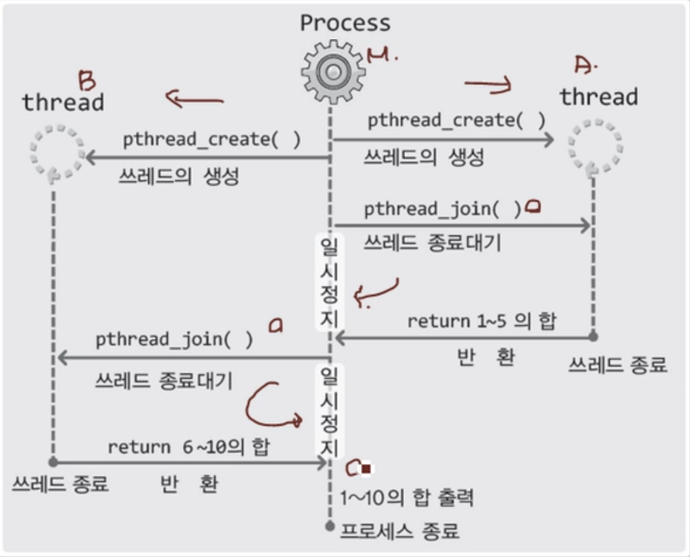

# 스레드

<br>

### 스레드 생성 방법

<br>

```c
#include<pthread.h>
int pthread_create(
		pthread_t *restrict thread, const pthread_attr_t *restrict attr,
		void *(*start_routine)(void*), void *restrict arg);
// thread: 생성할 스레드의 ID 저장을 위한 변수의 주소 값 전달
//         참고로 스레드는 프로세스와 마찬가지로 스레드 구분을 위한 ID가 부여된다
// attr: 스레드에 부여할 특성 정보의 전달을 위한 매개변수, NULL 전달 시 기본적인
//				특성의 스레드가 생성된다
// start_routine: 스레드의 main 함수 역할을 하는, 별도 실행흐름의 시작이 되는 
//                함수의 주소 값(함수 포인터) 전달
// arg: 세 번째 인자를 통해 등록된 함수가 호출될 때 전달할 인자의 정보를 담고있는
//      변수의 주소 값 전달
```
- 성공 시 0, 실패 시 0 이외의 값 반환

<br>

### 스레드의 종료를 대기하는 join

<br>

```c
int pthread_join(pthread_t thread, void **status);
// thread: 이 매개변수에 전달되는 ID의 스레드가 종료될 때 까지 함수는 반환하지 않는다
// status: 스레드의 main 함수가 반환하는 값이 저장 될 포인터 변수의 주소 값을 전달한다
```
 - 헤더파일 선언 이전에 매크로 `_REENTRANT`를 정의하면 스레드에 불안전한 함수 호출문을 스레드에 안전한 함수의 호출문으로 자동 변경 컴파일 된다.

<br>

### 워커 스레드 모델



<br>

## 스레드 동기화

<br>

### 뮤텍스의 생성과 소멸

<br>

```c
int pthread_mutex_init(pthread_mutex_t *mutex, const pthread_mutexattr_t *attr);
int pthread_mutex_destroy(pthread_mutex_t *mutex);
// mutex: 뮤텍스 생성시에는 뮤텍스의 참조 값 저장을 위한 변수의 주소 값 전달,
//        그리고 뮤텍스 소멸 시에는 소멸하고자 하는 뮤텍스의 참조 값을 저장하고
//        있는 변수의 주소 값 전달
// attr: 생성하는 뮤텍스의 특성정보를 담고 있는 변수의 주소 값 전달,
//       별도의 특성을 지정하지 않을 경우에는 NULL 전달
```

<br>

### 뮤텍스의 획득과 반환

<br>

```c
int pthread_mutex_lock(pthread_mutex_t *mutex);    // 뮤텍스 획득
int pthread_mutex_unlock(pthread_mutex_t *mutex);  // 뮤텍스 반환

pthread_mutex_lock(&mutex);
pthread_mutex_unlock(&mutex);
```
- lock, unlock 연산은 리소스를 많이 소모하기 때문에 호출 횟수를 최소화하는 것이 좋다

<br>

### 스레드의 종료와 동시에 소멸

<br>

```c
int pthread_detach(pthread_t thread);
// thread: 종료와 동시에 소멸시킬 스레드의 ID 정보 전달
```
- join 함수의 호출은 블로킹 상태에 놓이기 때문에 detach 함수를 호출해서 스레드의 소멸을 도와야한다.

<br>

## Windows 에서의 스레드 사용

<br>

### 커널 오브젝트(Kernel Object)
- 운영체제는 수많은 리소스들을 관리한다
- `커널 오브젝트란` 프로세스의 다양한 정보를 담고있는 구조체
- 커널 오브젝트를 참조하고 있다는 것은 해당 프로세스에 대한 정보를 유지하고 있다는 것
- 리소스의 종류에 따라 커널 오브젝트가 다르다
- 스레드 생성시 운영체제는 스레드를 대표하는(가르키는) 핸들(Handle)을 반환한다
- 핸들 ↔ 커널 오브젝트 ↔ 리소스의 구조
- 리소스의 모든 정보는 커널 오브젝트에 등록되어 있다
- `운영체제가 만드는 리소스의 유형`
    - 프로그램의 실행과 관련된 프로세스와 스레드
    - 입출력의 도구가 되는 소켓과 파일
    - 스레드간 동기화의 도구로 사용되는 세마포어와 뮤텍스
- `리소스와 커널 오브젝트의 관계`
    - 리소스 관리를 위해서 운영체제가 만드는 데이터 블록이 커널 오브젝트이다.
    - 커널 오브젝트에는 해당 리소스의 정보가 저장되어 있다
    - 리소스의 종류에 따라서 생성되는 커널 오브젝트의 형태에도 차이가 있다.
- `커널 오브젝트의 소유자`
    - 커널 오브젝트의 생성, 관리 및 소멸은 운영체제가 담당한다
    - 즉, 커널 오브젝트의 소유자는 운영체제이다

<br>

### 스레드를 생성하는 CreateThread 함수

<br>

```c
#include<windows.h>

HANDLE CreateThread(
	LPSECURITY_ATTRIBUTES lpThreadAttributes,
	SIZE_T dwStackSize,
	LPTHREAD_START_ROUTINE lpStartAddress,
	LPVOID lpParameter,
	DWORD dwCreationFlags,
	LPDWORD lpThreadId
);
// lpThreadAttributes: 스레드의 보안관련 정보 전달, 디폴트 보안설정을 위해 NULL 전달
// dwStackSize: 스레드에게 할당할 스택의 크기를 전달, 0 전달 시 디폴트 크기의 스택 생성
// lpStartAddress: 스레드의 main함수 정보 전달
// lpParameter: 스레드의 main함수 호출 시 전달할 인자정보 전달
// dwCreationFlags: 스레드의 생성 이후의 행동을 결정, 0을 전달하면 생성과 동시에 실행 가능한 상태가 된다.
// lpThreadId: 스레드 ID의 저장을 위한 변수의 주소 값 전달
```
- 성공 시 thread handle, 실패 시 NULL 반환

<br>

### 안전한 스레드 생성을 위한 _beginthreadex

<br>

```c
#include<process.h>

uintprt_t _beginthreadex(
	void *security,
	unsigned stack_size,
	unsigned (*start_address)(void *),
	void *arglist,
	unsigned initflag,
	unsigned *thrdaddr
);
```
- 성공 시 thread handle, 실패 시 0 반환
- 표준 C/C++ 함수의 호출이 필요한 프로그램 작성 시 반드시 위의 함수를 통해서 스레드를 생성해야 한다

<br>

### 스레스 생성 예시

<br>

```c
#include<process.h>

unsigned WINAPI ThreadFunc(void *arg);

int main(int argc, char *argv[])
{
	HANDLE hTrehad;
	unsigned threadID;
	int param=5;
	hThtread=(HANDLE)_beginthreadex(NULL, 0, ThreadFunc , (void*)&param, 0, &threadID);
	if(hThread==0)
	{
		puts("_beginthreadex() error");
		return -1;
	}
	Sleep(3000);
	puts("end of main");
	return 0;
}

unsigned WINAPI ThreadFunc(void *arg)
{
	int i;
	int cnt=*((int*)arg);
	for(i=0; i<cnt; i++)
	{
		Sleep(1000);
		puts("running thread");
	}
	return 0;
}
```
- 스레드의 실행 흐름을 예측할 수 없으므로 결과 값이 다르게 나올 수 있다
- 윈도우의 스레드는 스레드 함수를 반환하면 자동으로 소멸된다

<br>

### 커널 오브젝트의 두가지 상태
- 현재 스레드가 실행중인가에 대한 상태를 나타낸다
- 대부분의 커널 오브젝트는 non-signaled 상태에서 시작해 종료되면 signaled 상태가 된다
- signaled state: 이벤트가 발생한 상태, 해당 리소스가 특정 상황에 도달한 상태
- non-signaled state: 이벤트가 발생하지 않은 상태, 해당 리소스가 특정 상황에 이르지 않은 상태

<br>

### 커널 오브젝트의 상태 확인

<br>

```c
#include<windows.h>

DWORD WaitForSingleObject(HANDLE hHandle, DWORD dwMilliseconds);
// hHandle: 상태확인의 대상이 되는 커널 오브젝트의 핸들을 전달
// dwMilliseconds: 1/1000초 단위로 타임아웃을 지정, 인자로 INFINITE 전달 시,
//                 커널 오브젝트가 signaled 상태가 되기 전에는 반환하지 않는다
// return: signaled 상태로 인한 반환 시, WAIT_OBJECT_0 반환, 타임아웃으로 인한
//                  반환 시 WAIT_TIMEOUT 반환
```
- 성공 시 이벤트 정보, 실패 시 WAIT_FAILED 반환

<br>

### 다수의 커널 오브젝트 상태 확ㅇ니

<br>

```c
#include<windows.h>

DWORD WaitForMultipleObjects(
	DWORD nCount, const HANDLE* lpHandles, BOOL bWaitAll, DWORD dwMilliseconds);
// nCount: 검사할 커널 오브젝트의 수 전달
// lpHandles: 핸들정보를 담고 있는 배열의 주소 값 전달
// bWaitAll: TRUE 전달 시, 모든 검사대상이 signaled 상태가 되어야 반환
//           FALSE 전달 시, 검사대상 중 하나라도 signaled 상태가 되면 반환
// dwMilliseconds: 1/1000초 단위로 타임아웃을 지정, 인자로 INFINITE 전달 시,
//                 커널 오브젝트가 signaled 상태가 되기 전에는 반환하지 않는다
```
- 성공 시 이벤트 정보, 실패 시 WAIT_FAILED 반환
- auto-reset 모드 커널 오브젝트: 호출된 함수가 반환되면서 자동으로 non-signaled 상태로 변경되는 커널 오브젝트
- manual-reset 모드 커널 오브젝트: 호출된 함수가 반환되면서 자동으로 non-signaled 상태로 변경되지 않는 커널 오브젝트
    - 수동으로 non-signaled 상태로 변경해주어야 한다

<br>

### 커널 오브젝트의 상태 확인 예시

<br>

```c
#include<process.h>

unsigned WINAPI ThreadFunc(void *arg);

int main(int argc, char *argv[])
{
	HANDLE hThread;
	DWORD wr;
	unsigned threadID;
	int param=5;
	hThread=(HANDLE)_beginthreadex(NULL, 0, ThreadFunc, (void*)&param, 0, &threadID);
	if(hThread==0)
	{
		puts("_beginthreadex() error");
		return -1;
	}
	if((wr=WaitForSingleObject(hThread, INFINITE))==WAIT_FAILED)
	{
		puts("thread wait error");
		return -1;
	}
	printf("wait result: $s \n", (wr==WAIT_OBJECT_0) ? "signaled":"time-out");
	return 0;
}

unsigned WINAPI ThreadFunc(void *arg)
{
	int i;
	int cnt=*((int*)arg);
	for(i=0; i<cnt; i++)
	{
		Sleep(1000);
		puts("running thread");
	}
	return 0;
}
```
- 스레드가 종료되면 커널 오브젝트가 signaled 상태로 변경된다

<br>

## windows에서의 스레드 동기화

<br>

### 동기화 기법의 분류와 critical section 동기화
- 유저모드: 응용 프로그램이 실행되는 기본모드로, 물리적인 영역으로의 접근이 허용되지 않으며 접근할 수 있는 메모리의 영역에도 제한이 따른다
- 커널모드: 운영체제가 실행될 때의 모드로, 메모리 뿐만 아니라 하드웨어의 접근에도 제한이 따르지 않는다
- 유저모드는 응용프로그램의 실행모드, 커널모드는 운영체제의 실행모드이다

<br>

### 유저모드 동기화


<br>

### 커널모드 동기화
